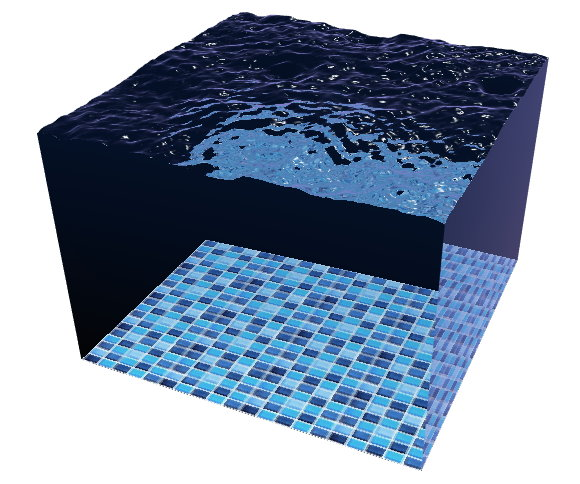

# pool-webgl

## Description
Water surface simulation, running on GPU with WebGL.

This is a WebGL port of my project [water-simulation-gpu](https://github.com/piellardj/water-simulation-gpu).

See it live [here](https://piellardj.github.io/pool-webgl/?page%3Acanvas%3Afullscreen=true&page%3Acanvas%3Asidepane=true).

